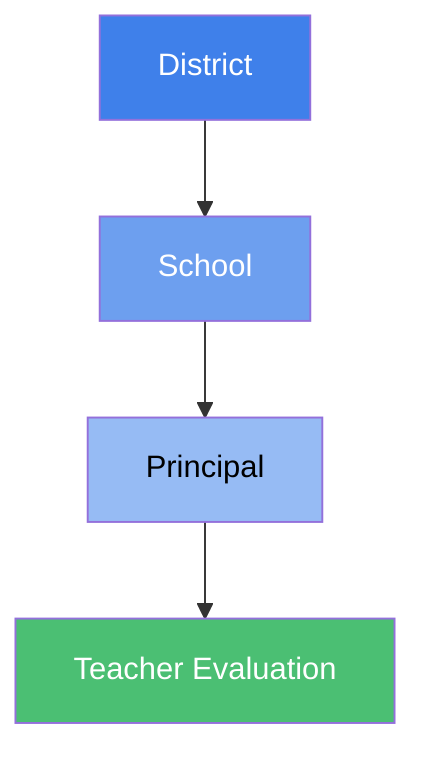
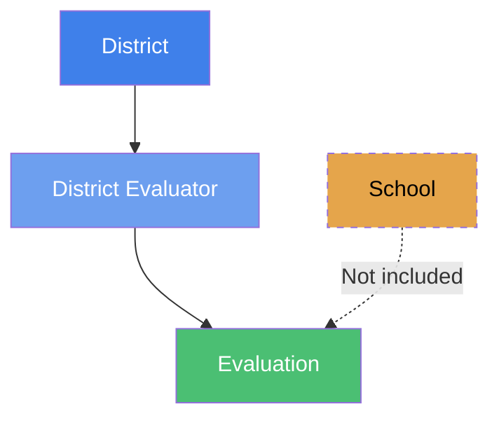

# How Settings Are Inherited

eVAL uses an inheritance system to share configurations down the organizational hierarchy. This ensures consistent evaluation standards while allowing appropriate customization at different levels.

## What Can Be Configured

Six areas can be configured and inherited:

| Area | What It Is | How It Inherits |
|------|-----------|-----------------|
| **Prompt Bank** | Pre-defined questions and reflection prompts | Additive — items combine from all levels |
| **Resources** | Documents and reference materials | Additive — items combine from all levels |
| **Module Settings** | Configuration options for each module | Override — lower levels replace higher |
| **Optional Modules** | Which modules are enabled/disabled | Override — lower levels replace higher |
| **Email Notifications** | Required notification events | Additive — items combine from all levels |
| **Report Configuration** | Report templates and settings | Override — lower levels replace higher |

### Additive vs Override

- **Additive** — Items from higher levels combine with items from lower levels. If the district defines 5 prompts and the school adds 3, users see all 8.
- **Override** — Lower levels can replace higher level settings. If the district disables a module but the school enables it, the school's setting takes effect.

---

## The Core Rule

:::info Key Principle
**Inheritance flows from the evaluator's organizational position**, not the evaluatee's.
:::

This means:
- **School principals** evaluating teachers → inherit from both district and school
- **District evaluators** (DTE, DPE) → inherit from district only

---

## Who Gets What Settings

### Principal Evaluating Teachers

When a principal evaluates teachers at their school, settings flow through the full hierarchy:

The evaluation receives:
- **Additive areas** — District + School combined
- **Override areas** — School setting if set, otherwise District

### District Evaluators (DTE, DPE)

When a district evaluator evaluates a teacher or principal:

:::warning School Settings Not Included
District evaluator evaluations use only district-level settings. School-level settings are bypassed.
:::

**Why?** District evaluators often work with staff who serve multiple schools (specialists, itinerant teachers). Using only district settings ensures consistency regardless of which schools the evaluatee serves.

### Principal Evaluations

All principal evaluations (whether by DPE or head principal evaluating an assistant principal) use only district-level settings. School-level configuration for principal evaluations is not used.

---

## Summary

| Evaluation Type | District Settings | School Settings |
|-----------------|-------------------|-----------------|
| Principal → Teacher | Yes | Yes |
| DTE → Teacher | Yes | No |
| DPE → Principal | Yes | No |
| Principal → Asst. Principal | Yes | No |

:::tip Key Takeaway
Only teacher evaluations conducted by school principals include school-level settings. All other evaluations inherit from district level only.
:::

---

## For Administrators

### District Administrators

Your configurations:
- Set the baseline for all evaluations in your district
- Apply directly to all district-level evaluations
- Can be overridden by schools for teacher evaluations (in override areas)

### School Administrators

Your configurations (for teacher evaluations):
- Add to district prompts, resources, and email notifications
- Can override district module settings and optional modules
- Apply to teacher evaluations where your school's principal is the evaluator

School-level configuration for principal evaluations is not used — principal evaluations always use district settings only.

---

## Related Topics

- [Modules and Settings](./modules-settings.md)
- [Work Areas](../getting-started/work-areas.md)
