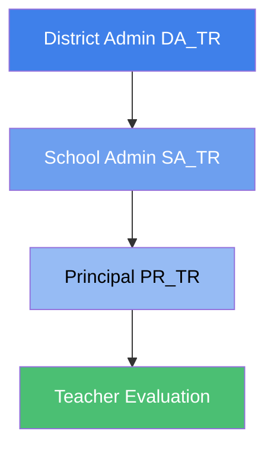
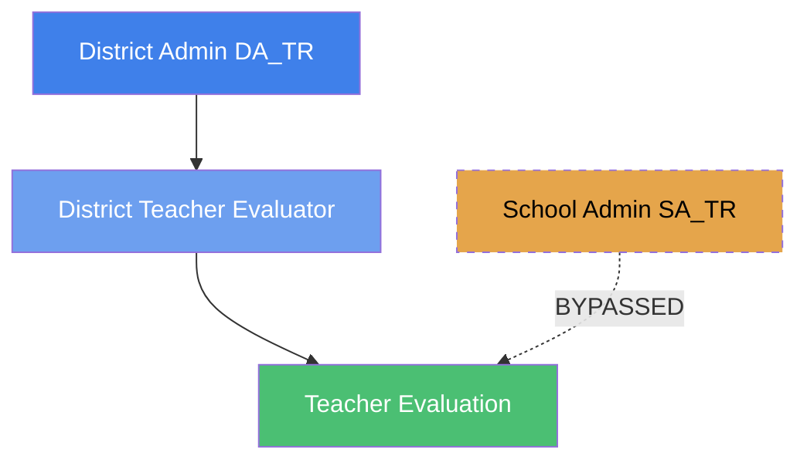
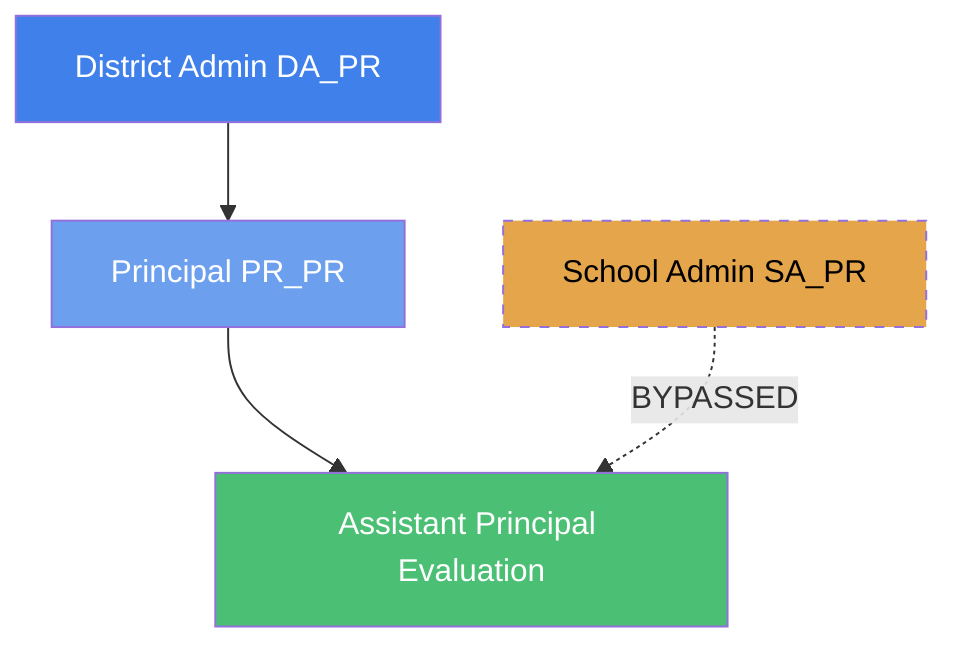

import Tabs from '@theme/Tabs';
import TabItem from '@theme/TabItem';

# How Settings Are Inherited in eVAL

eVAL uses an inheritance system to share configurations down the organizational hierarchy. This ensures consistent evaluation standards while allowing appropriate customization at different levels.

## Configurable Areas

Six areas can be configured and are inherited through the system:

| Area | What It Is | Pattern |
|------|-----------|---------|
| **Prompt Bank** | Pre-defined questions and reflection prompts for evaluations | <span class="badge badge--additive">Additive</span> |
| **Resources** | Documents, links, and reference materials viewable within evaluations | <span class="badge badge--additive">Additive</span> |
| **Module Settings** | Configuration options within each evaluation module | <span class="badge badge--override">Override</span> |
| **Optional Modules** | Which evaluation modules are enabled or disabled | <span class="badge badge--override">Override</span> |
| **Email Notifications** | Required email notification events | <span class="badge badge--additive">Additive</span> |
| **Report Configuration** | Report templates and settings | <span class="badge badge--override">Override</span> |

### Understanding the Patterns

<div class="card-grid">
<div class="card">
<div class="card__title">Additive Pattern</div>
<p class="card__description">Items from higher levels are combined with items from lower levels. If the district defines 5 prompts and the school adds 3 more, users see all 8 prompts.</p>
</div>
<div class="card">
<div class="card__title">Override Pattern</div>
<p class="card__description">Lower levels can replace higher level settings. If the district disables a module but the school enables it, the school's setting takes effect.</p>
</div>
</div>

---

## The Core Inheritance Rule

:::info Key Principle
**Inheritance flows from the EVALUATOR's organizational position**, not the evaluatee's position.
:::

This means:
- **District-level evaluators** (DTE, DPE) inherit from district configuration only
- **School-level evaluators** (principals evaluating teachers) inherit from both district and school configuration

---

## Inheritance by Evaluation Scenario

<Tabs>
<TabItem value="pr-tr" label="Principal → Teacher" default>

### Principal Evaluating Teachers (PR_TR → TR_ME)

When a principal evaluates teachers at their school, settings flow through the full hierarchy:



**What the evaluation receives:**

| Area | Source |
|------|--------|
| Prompt Bank | District + School + Evaluator's personal prompts (merged) |
| Resources | District + School (merged) |
| Module Settings | School override, or District default |
| Optional Modules | School override, or District default |
| Email Notifications | District + School (merged) |
| Report Configuration | School override, or District default |

**Example - Prompt Bank:**
- District provides 5 baseline prompts
- School adds 3 school-specific prompts
- Principal adds 2 personal prompts
- **Result:** Teacher sees all 10 prompts in their evaluation

**Example - Module Settings:**
- District sets `CODED_NOTES = Disabled`
- School overrides to `CODED_NOTES = Enabled`
- **Result:** Coded Notes is enabled for evaluations at that school

</TabItem>
<TabItem value="dte" label="DTE → Teacher">

### District Teacher Evaluator (DTE → TR_ME)

When a District Teacher Evaluator evaluates a teacher (typically specialists like PE, Art, or Special Education teachers who serve multiple schools):



:::warning School Settings Bypassed
School-level settings are NOT included in DTE evaluations.
:::

**What the evaluation receives:**

| Area | Source |
|------|--------|
| Prompt Bank | District + Evaluator's personal prompts only |
| Resources | District only |
| Module Settings | District only |
| Optional Modules | District only |
| Email Notifications | District only |
| Report Configuration | District only |

**Why school settings are bypassed:**
- DTE typically evaluates teachers who serve multiple schools
- District-level standardization ensures consistency regardless of which schools the teacher serves
- Avoids complexity of choosing a "primary school" for settings

</TabItem>
<TabItem value="dpe" label="DPE → Principal">

### District Principal Evaluator (DPE → PR_ME)

When a District Principal Evaluator evaluates a head principal:


:::warning School Settings Bypassed
School-level settings are NOT included in principal evaluations.
:::

**What the evaluation receives:**

| Area | Source |
|------|--------|
| Prompt Bank | District + Evaluator's personal prompts only |
| Resources | District only |
| Module Settings | District only |
| Optional Modules | District only |
| Email Notifications | District only |
| Report Configuration | District only |

**Why school settings are bypassed:**
- There is typically only one head principal per school
- School-level customization for principal evaluations adds unnecessary complexity
- District standardization is appropriate for leadership evaluations

</TabItem>
<TabItem value="pr-pr" label="Principal → Asst. Principal">

### Principal Evaluating Assistant Principals (PR_PR → PR_ME)

When a head principal evaluates an assistant principal at their school:



:::warning School Settings Bypassed
School-level settings are NOT included even when a principal evaluates their assistant principal.
:::

**What the evaluation receives:**

| Area | Source |
|------|--------|
| Prompt Bank | District + Evaluator's personal prompts only |
| Resources | District only |
| Module Settings | District only |
| Optional Modules | District only |
| Email Notifications | District only |
| Report Configuration | District only |

**Why school settings are bypassed:**
- Principal evaluations follow the same inheritance pattern regardless of who conducts them
- Simplifies configuration and reduces UI complexity
- Only one or two principals per school makes school-level customization unnecessary

</TabItem>
</Tabs>

---

## Inheritance Matrix Summary

This table shows what each evaluator type inherits from each level:

<div class="matrix-table">

| Area | Pattern | Principal → Teacher | DTE → Teacher | DPE → Principal | Principal → Asst. Principal |
|------|---------|---------------------|---------------|-----------------|---------------------------|
| **Prompt Bank** | <span class="badge badge--additive">Additive</span> | District + School + Evaluator | District + Evaluator | District + Evaluator | District + Evaluator |
| **Resources** | <span class="badge badge--additive">Additive</span> | District + School | District only | District only | District only |
| **Module Settings** | <span class="badge badge--override">Override</span> | School or District | District only | District only | District only |
| **Optional Modules** | <span class="badge badge--override">Override</span> | School or District | District only | District only | District only |
| **Email Notifications** | <span class="badge badge--additive">Additive</span> | District + School | District only | District only | District only |
| **Report Configuration** | <span class="badge badge--override">Override</span> | School or District | District only | District only | District only |

</div>

:::tip Key Takeaway
Only teacher evaluations conducted by school principals include school-level settings. All other evaluations inherit from district level only.
:::

---

## Detailed Area Breakdown

<Tabs>
<TabItem value="prompts" label="Prompt Bank" default>

### Prompt Bank

Prompts are pre-defined questions and reflection items used throughout the evaluation process.

**Who can create prompts:**

| Level | Who | Scope |
|-------|-----|-------|
| District | District Admin | Available to all evaluations of that type in the district |
| School | School Admin | Available to teacher evaluations at that school |
| Evaluator | Individual evaluators | Available only in that evaluator's evaluations |

**How prompts are inherited:**
1. District prompts form the baseline
2. School prompts are **added** to district prompts (for principal → teacher evaluations)
3. Evaluator prompts are **added** to the combined set
4. All prompts from all applicable levels appear in the evaluation

</TabItem>
<TabItem value="resources" label="Resources">

### Resources

Resources are documents, links, and reference materials that users can access within their evaluation.

**Who can add resources:**

| Level | Who | Scope |
|-------|-----|-------|
| District | District Admin | Available to all evaluations of that type |
| School | School Admin | Available to teacher evaluations at that school |

**How resources are inherited:**
- District resources are always available
- School resources are **added** for principal → teacher evaluations
- District evaluator evaluations see only district resources

</TabItem>
<TabItem value="module-settings" label="Module Settings">

### Module Settings

Module settings are configuration options that control how evaluation modules behave.

**Examples of module settings:**
- `OBS_ALLOW_SCORING` - Whether scoring is allowed during observations
- `SA_ALLOW_SCORING` - Whether scoring is allowed in self-assessments
- `SUMMATIVE_CARRY_FORWARD_YEARS_LIMIT` - How many years scores can carry forward

**How settings are inherited:**
- District sets default values
- Schools can **override** district defaults
- The most specific applicable setting takes effect

**Example:**
```
District: SA_ALLOW_SCORING = true
School A: SA_ALLOW_SCORING = false (override)
School B: (no override)

Result:
- School A evaluations: SA_ALLOW_SCORING = false
- School B evaluations: SA_ALLOW_SCORING = true
```

</TabItem>
<TabItem value="optional-modules" label="Optional Modules">

### Optional Modules

Optional modules determine which evaluation features are enabled or disabled.

**Examples of optional modules:**
- `OBSERVATIONS` - Classroom/leadership observations
- `SELF_ASSESSMENTS` - Evaluatee self-reflection
- `CODED_NOTES` - Evaluator informal notes
- `STUDENT_GROWTH` - Student growth goal tracking
- `MID_YEAR` - Mid-year review process

**How modules are inherited:**
- District enables or disables modules by default
- Schools can **override** to enable or disable for their school
- Only applies to principal → teacher evaluations; other evaluation types use district settings only

</TabItem>
<TabItem value="email" label="Email Notifications">

### Email Notifications

Email notifications control which evaluation events trigger email alerts.

**Examples of notification events:**
- Observation scheduled
- Artifact submitted
- Summative report ready
- Mid-year review reminder

**How notifications are inherited:**
- District defines required notifications for all users
- Schools can **add** additional required notifications
- Users can then configure their personal preferences within the inherited requirements

</TabItem>
<TabItem value="reports" label="Report Configuration">

### Report Configuration

Report settings control how evaluation reports are generated and what they contain.

**How settings are inherited:**
- District sets default report configuration
- Schools can **override** with their own templates
- Applies only to principal → teacher evaluations

</TabItem>
</Tabs>

---

## For Administrators

### District Administrators

As a district administrator, your configurations:
- Set the **baseline** for all evaluations in your district
- Apply directly to all **district-level evaluations** (DTE and DPE evaluations)
- Can be overridden by schools for **teacher evaluations** (in override areas)
- Cannot be overridden for **principal evaluations**

### School Administrators (Teacher Evaluations)

As a school administrator for teacher evaluations (SA_TR), your configurations:
- **Add to** district prompts, resources, and email notifications
- Can **override** district module settings, optional modules, and report configuration
- Apply to all teacher evaluations where your school's principal is the evaluator

### School Administrators (Principal Evaluations)

School-level configuration for principal evaluations (SA_PR) is **not used** in the inheritance chain. Principal evaluations always inherit from district configuration only.

---

## Special Cases

### Teachers Evaluated by District Teacher Evaluators

If you're a teacher being evaluated by a DTE (rather than your principal), your evaluation uses only district-level settings. This is common for:
- PE teachers serving multiple schools
- Art specialists
- Special education teachers
- Other specialists who work across school boundaries

### Multi-District Users

If you work in multiple districts, each evaluation uses its respective district's settings. Email notification preferences must be configured separately for each district context.

---

## Related Topics

- [Understanding Work Areas](../getting-started/work-areas)
- [Modules and Settings](./modules-settings)
