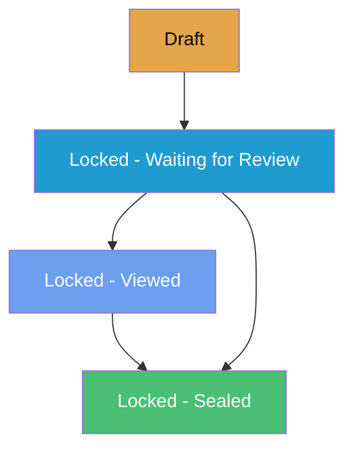
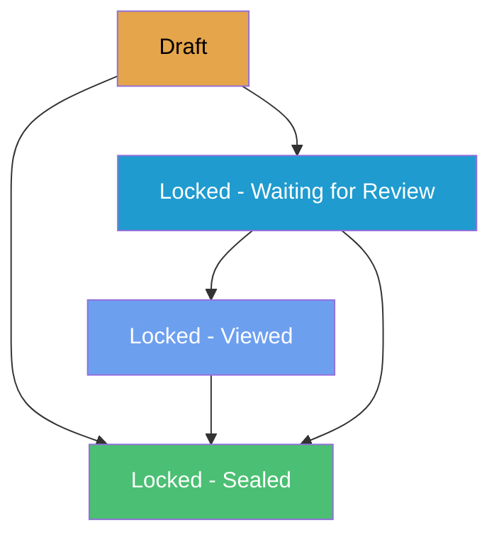
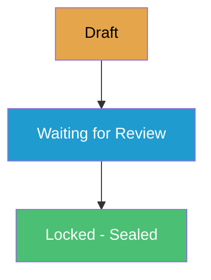
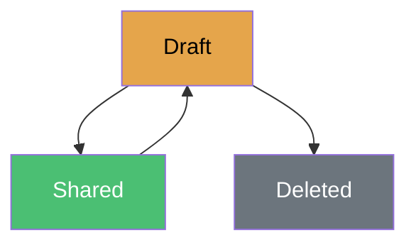
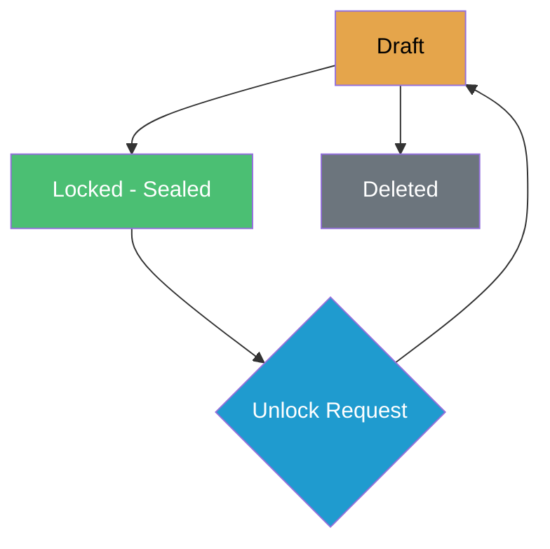
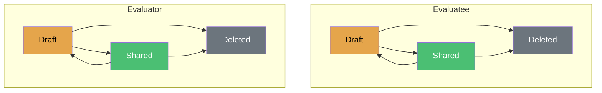
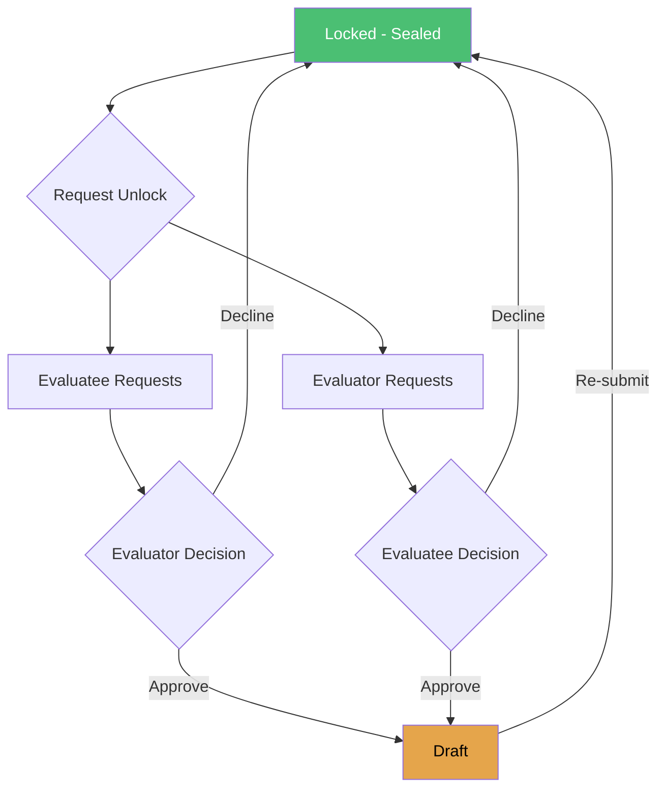

import Tabs from '@theme/Tabs';
import TabItem from '@theme/TabItem';

# How Workflows Work in eVAL

Each evidence collection in eVAL follows a specific workflow that controls how content moves from draft to final state. Understanding these workflows helps you know what to expect and what actions are available at each step.

## Workflow Patterns at a Glance

Evidence collections fall into two categories based on how they're managed:

### Completion Mode Workflows

Most evidence collections use a **completion mode** that determines whether the other party must review and acknowledge before the collection is finalized:

| Mode | How It Works | Default For |
|------|--------------|-------------|
| **Simple** | Submits directly to locked/sealed. Other party is notified and can view. | Observations, Coded Notes |
| **Formal** | After submission, other party must review and acknowledge before final lock. | Student Growth, Summative Evaluation |

**Why the difference?** Evidence collections that contribute **scores** to the final performance rating (Student Growth, Summative) default to Formal mode because those scores have significant impact. Collections focused on **evidence gathering** (Observations, Coded Notes) default to Simple mode to handle higher volumes efficiently.

:::info District Configuration
These are defaults. Districts can configure which mode is used for each evidence collection type in Module Settings.
:::

### Creator-Managed Workflows

Self-Assessments and Artifacts don't use completion modes. The creator simply manages them directly:
- Work privately in Draft
- Share when ready
- Unlock to make revisions
- Re-share to update

| Evidence Collection | Owner | Contributes to Summative |
|---------------------|-------|--------------------------|
| **Self-Assessment** | Evaluatee | No (reflection tool only) |
| **Artifacts** | Either party | Yes (evidence) |

### Year-to-Date Evidence

YTD Evidence is primarily an aggregator that displays published evidence from other collections. See the [Year-to-Date tab](#ytd) for details.

---

## Common Workflow States

Most evidence collections use these states:

| State | What It Means |
|-------|---------------|
| **Draft** | Work in progress. Can be edited freely. |
| **Waiting for Review** | Submitted and waiting for the other party to review. |
| **Viewed** | The other party has seen it but hasn't acknowledged yet. |
| **Locked - Sealed** | Finalized. Cannot be edited without an unlock request. |
| **Shared** | Visible to both parties (for simpler workflows). |

---

## Detailed Workflows

<Tabs>
<TabItem value="observations" label="Observations" default>

### Observation Workflow

Observations follow a review process where the evaluator creates content and optionally the evaluatee reviews and acknowledges the final report.

:::note Completion Mode
The diagram below shows **Formal Mode** with evaluatee review. In **Simple Mode**, the evaluator locks directly from Draft to Sealed without the review steps.
:::

**Draft**
- Evaluator creates and edits observation
- Can send pre/post-conference prompts
- Can link artifacts
- Can share sections with evaluatee
- **Can be deleted** in this state

**Locked - Waiting for Review**
- Evaluator has sent the Final Report
- Evaluatee can view the report
- Evaluator can force-lock (skip evaluatee review)

**Locked - Viewed**
- Evaluatee has viewed the Final Report
- Evaluatee can acknowledge
- Evaluator can lock

**Locked - Sealed**
- Observation is finalized
- Either party can request to unlock (requires other party approval)

</TabItem>
<TabItem value="evaluation" label="Summative Evaluation">

### Summative Evaluation Workflow

The summative evaluation follows a similar pattern to observations, with additional features for district admin override and "drop to paper."

:::note Formal Mode
Summative evaluations typically use **Formal Mode** because they represent your final performance rating and serve as a legal record. This requires evaluatee review and acknowledgment.
:::

**Draft**
- Evaluator works on the evaluation
- Can send reflection prompts to evaluatee
- Can change plan type
- Three paths to lock:
  1. Send for review (standard path)
  2. Lock directly (bypass review)
  3. Drop to paper (terminate in eVAL)

**Locked States**
- Same as observations
- **District Admin can revert** any locked state back to Draft (without needing other party approval)

**Drop to Paper**
- Terminates the digital evaluation
- Evaluation continues using paper forms
- Cannot be reversed

</TabItem>
<TabItem value="student-growth" label="Student Growth">

### Student Growth Workflows

Student Growth has two separate but identical workflows:
1. **Goal Setting** - at the beginning of the year
2. **Achievement** - at the end of the year

Both follow a "submit and approve" pattern where the evaluatee owns the content and the evaluator approves.

:::note Simple Mode
Student Growth typically uses **Simple Mode** - when the evaluator approves, the collection is immediately sealed. This helps manage the November deadline when many teachers are submitting goals simultaneously.
:::

**Draft**
- **Evaluatee** creates and edits goals/achievement data
- Can share work-in-progress with evaluator for feedback
- Evaluator can view shared content (read-only)
- Both parties can add evidence/artifacts

**Waiting for Review**
- Evaluatee has submitted
- Evaluator reviews and approves
- If changes needed, evaluator can request unlock

**Locked - Sealed**
- Goals/achievement data approved
- Either party can request unlock (requires mutual agreement)

:::tip Key Difference
Unlike observations, the **evaluatee controls submission** and the **evaluator only approves**. The evaluator cannot edit goal content directly.
:::

</TabItem>
<TabItem value="self-assessment" label="Self-Assessment">

### Self-Assessment Workflow

Self-assessments are a reflective tool for evaluatees. They can be kept private, shared with the evaluator, and unlocked for revisions.

**Draft**
- Evaluatee creates and edits
- Private - only evaluatee can see
- Can link artifacts
- Can share with evaluator
- Can delete

**Shared**
- Visible to both parties
- Cannot be edited directly
- **Can be unlocked** by the evaluatee to make revisions
- Cannot be deleted (must unlock first, then delete from Draft)

**Revising After Sharing**
1. Evaluatee unlocks the self-assessment (returns to Draft)
2. Make revisions in Draft
3. Re-share to publish the updated version

:::tip
Unlike locked evidence collections, the evaluatee can unlock a self-assessment directly without requesting approval from the evaluator.
:::

:::info Not Included in Summative
Self-assessments are for reflection and goal-setting purposes. Evidence and scores created within a self-assessment do **not** flow to YTD Evidence or the Summative Evaluation, even after sharing.
:::

</TabItem>
<TabItem value="coded-notes" label="Coded Notes">

### Coded Notes Workflow

Coded notes are evaluator-created notes linked to specific rubric criteria. They follow a locking workflow similar to observations.

:::note Completion Mode
The diagram below shows **Simple Mode** where the coded note locks directly when submitted. In **Formal Mode**, the evaluatee reviews and acknowledges before final lock.
:::

**Draft**
- Evaluator creates and edits
- Links notes to rubric criteria
- Private - only evaluator can see
- Can share sections with evaluatee before submission
- Can submit or delete
- **Can only be deleted** in this state

**Locked - Sealed**
- Visible to both parties
- Evidence flows to YTD and Summative views
- Cannot be edited without unlocking
- Either party can request unlock

**Unlocking**
- Either party requests unlock
- Other party approves or declines
- If approved, returns to Draft for revisions
- After revisions, evaluator re-submits to update published evidence

:::note Use Cases
Coded notes are useful for:
- Walkthrough observations
- Informal feedback
- Notes from professional conversations
:::

</TabItem>
<TabItem value="artifacts" label="Artifacts">

### Artifact Workflow

Artifacts have **two parallel workflows** - one for evaluatee artifacts and one for evaluator artifacts. Each party owns and controls their own artifacts.

**For Both Tracks:**

**Draft**
- Creator uploads files and writes description
- Private to creator
- Can share or delete

**Shared**
- Visible to both parties
- Evidence flows to YTD and Summative views
- Can re-share to push minor updates
- **Can be unlocked** to return to Draft for more significant revisions
- **Can be deleted** by creator

**Revising After Sharing**
- **Quick updates**: Re-share directly from Shared state
- **Significant revisions**: Unlock → Draft → make changes → re-share

:::tip
Artifacts offer the most flexibility for revisions. Unlike other evidence collections, the creator can unlock their own artifact without approval from the other party.
:::

</TabItem>
<TabItem value="ytd" label="Year-to-Date">

### Year-to-Date Evidence

Year-to-Date (YTD) Evidence is primarily an **aggregator** — it displays all published evidence from other evidence collections (observations, coded notes, artifacts, student growth) organized by rubric component.

**What YTD Shows:**
- Evidence from submitted observations
- Evidence from submitted coded notes
- Evidence from shared artifacts
- Evidence from approved student growth goals/achievement

**Optional Activity: Rubric Notes**

If enabled by district settings, both parties can add Rubric Notes directly within YTD Evidence. These are simple text notes aligned to rubric components.

- Both parties can add and delete their own notes
- Notes are immediately visible to both parties
- No workflow states — always editable

:::note
Most evidence comes through other evidence collections (observations, artifacts, etc.). Adding Rubric Notes directly in YTD is an optional feature that districts may or may not enable.
:::

</TabItem>
</Tabs>

---

## Completion Modes in Detail

### How the Modes Differ

| Aspect | Simple Mode | Formal Mode |
|--------|-------------|-------------|
| **Other party review** | Not required | Required before final lock |
| **Digital signatures** | No | Yes |
| **Time to complete** | Faster | Slower (waiting for review) |
| **Force lock option** | N/A | Owner can force-lock if other party doesn't respond |
| **Best for** | High-volume evidence gathering | Score-contributing activities |

### Safety Nets in Simple Mode

Even when the other party's review isn't required, safeguards exist:

- **Notifications** — You're notified when the collection is submitted
- **Visibility** — You can view the content immediately
- **Unlock requests** — Either party can request to unlock and revise
- **Audit trail** — All actions are logged

---

## Unlocking Published Evidence

When evidence is published (locked or shared), it cannot be edited directly. To make revisions, you must unlock it first. There are two unlocking mechanisms:

### Unlock Requests (Mutual Approval)

For evidence collections with locking workflows (Observations, Coded Notes, Evaluations, Student Growth), either party can request to unlock after it's sealed. The other party must approve.

**How Unlock Requests Work:**

1. One party requests unlock
2. The other party receives the request
3. The other party can **approve** (returns to Draft), **decline** (stays sealed), or the requester can **cancel**
4. If approved, make edits in Draft, then re-submit to update the published evidence

:::tip District Admin Override
For **Summative Evaluations only**, District Admins can revert any locked evaluation to Draft without requiring the other party's approval.
:::

### Direct Unlock (Creator Control)

For evidence collections with sharing workflows (Self-Assessments, Artifacts), the creator can unlock directly without approval from the other party.

| Evidence Collection | Who Can Unlock |
|---------------------|----------------|
| **Self-Assessment** | Evaluatee |
| **Artifact** | The party who created it |

This gives creators flexibility to revise their own shared evidence without waiting for approval.

---

## Workflow Comparison

### Evidence Collections with Completion Modes

| Feature | Observation | Coded Notes | Student Growth | Summative |
|---------|-------------|-------------|----------------|-----------|
| **Owner** | Evaluator | Evaluator | Evaluatee | Evaluator |
| **Default Mode** | Simple | Simple | Formal | Formal |
| **Contributes** | Evidence | Evidence | SG Scores | C1-C8 Scores |
| **Can Delete After Submit** | No | No | No | No |
| **DA Override** | No | No | No | Yes |
| **Unlock Mechanism** | Request | Request | Request | Request |

### Creator-Managed Evidence Collections

| Feature | Self-Assessment | Artifacts |
|---------|-----------------|-----------|
| **Owner** | Evaluatee | Either party |
| **Contributes** | No | Evidence |
| **Can Delete After Share** | No* | Yes |
| **Unlock Mechanism** | Direct | Direct |

*Must unlock first, then delete from Draft.

---

## Tips for Working with Workflows

### For Evaluatees

1. **Self-assessments can be unlocked** - If you need to revise, unlock it, make changes, and re-share
2. **You control student growth submissions** - Your evaluator can only approve, not edit your goals
3. **Use YTD Evidence for ongoing documentation** - It's collaborative and always accessible
4. **Artifacts can be updated** - Unlock or re-share to push revisions

### For Evaluators

1. **Evidence collections can only be deleted in Draft** - Plan deletions before submitting
2. **Coded notes are locked when submitted** - They follow the same locking workflow as observations
3. **Send prompts before locking** - Once sealed, you can't request additional input
4. **Review student growth goals carefully** - You're responsible for approving appropriate goals

### For Both Parties

1. **Locked collections require unlock requests** - One party requests, the other approves
2. **Self-assessments and artifacts allow direct unlock** - The creator doesn't need approval
3. **Draft state is your editing window** - Make all changes before progressing
4. **Unlocking doesn't remove published evidence** - Evidence remains visible while you revise; re-submit to update

---

## Related Topics

- [Evidence Collection](./evidence-collection.md)
- [Understanding Your Evaluation](./evaluation-basics.md)
