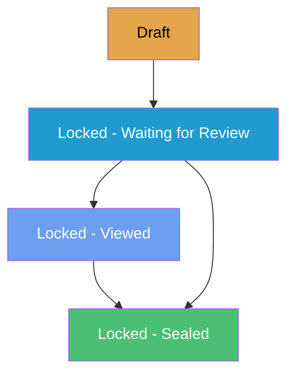
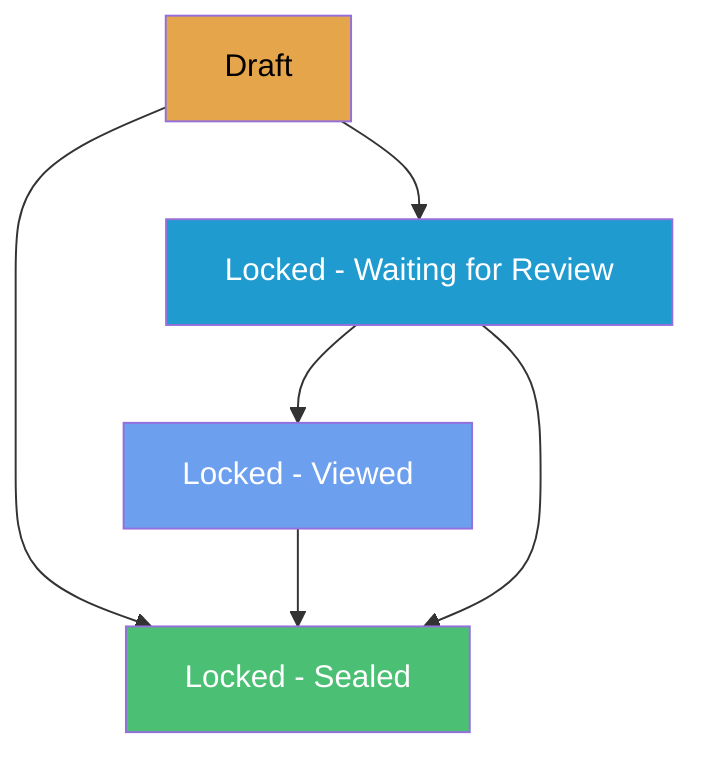
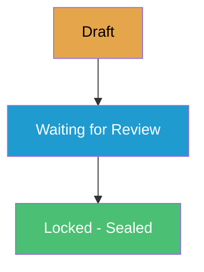
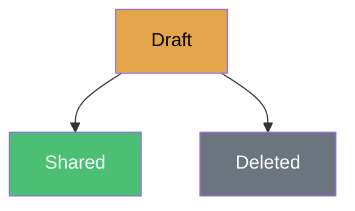
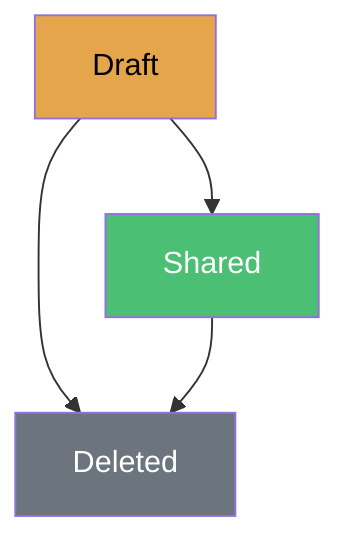
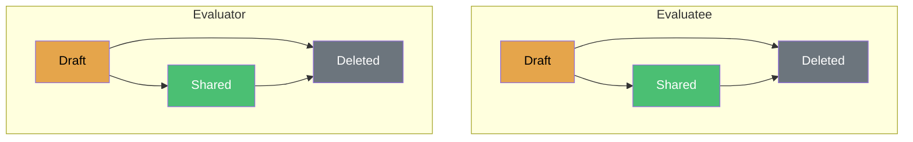
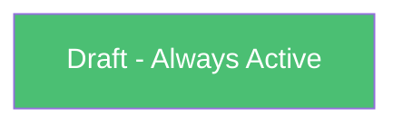
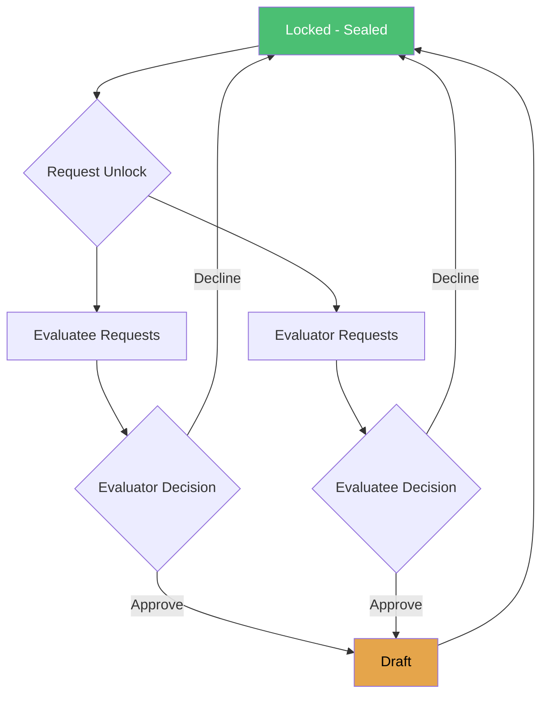

import Tabs from '@theme/Tabs';
import TabItem from '@theme/TabItem';

# How Workflows Work in eVAL

Each evidence collection in eVAL follows a specific workflow that controls how content moves from draft to final state. Understanding these workflows helps you know what to expect and what actions are available at each step.

## Workflow Patterns at a Glance

eVAL uses three main workflow patterns:

Complex Locking

Content goes through review before being locked. Used for formal evaluations.

Submit & Approve

One party submits, the other approves. Used for collaborative goal-setting.

Share Only

Creator works privately, then optionally shares. No formal approval.

| Evidence Collection | Pattern | Owner |
|---------------------|---------|-------|
| **Observations** | Complex Locking | Evaluator |
| **Summative Evaluation** | Complex Locking | Evaluator |
| **Student Growth Goals** | Submit & Approve | Evaluatee (Evaluator approves) |
| **Student Growth Achievement** | Submit & Approve | Evaluatee (Evaluator approves) |
| **Self-Assessment** | Share Only | Evaluatee |
| **Coded Notes** | Share Only | Evaluator |
| **Artifacts** | Share Only | Either party (separate tracks) |
| **Year-to-Date Evidence** | Always Open | Both parties (collaborative) |

---

## Common Workflow States

Most evidence collections use these states:

| State | What It Means |
|-------|---------------|
| **Draft** | Work in progress. Can be edited freely. |
| **Waiting for Review** | Submitted and waiting for the other party to review. |
| **Viewed** | The other party has seen it but hasn't acknowledged yet. |
| **Locked - Sealed** | Finalized. Cannot be edited without an unlock request. |
| **Shared** | Visible to both parties (for simpler workflows). |

---

## Detailed Workflows

<Tabs>
<TabItem value="observations" label="Observations" default>

### Observation Workflow

Observations follow a review process where the evaluator creates content and optionally the evaluatee reviews and acknowledges the final report.

:::note Completion Mode
The diagram below shows **Formal Mode** with evaluatee review. In **Simple Mode**, the evaluator locks directly from Draft to Sealed without the review steps.
:::

**Draft**
- Evaluator creates and edits observation
- Can send pre/post-conference prompts
- Can link artifacts
- Can share sections with evaluatee
- **Can be deleted** in this state

**Locked - Waiting for Review**
- Evaluator has sent the Final Report
- Evaluatee can view the report
- Evaluator can force-lock (skip evaluatee review)

**Locked - Viewed**
- Evaluatee has viewed the Final Report
- Evaluatee can acknowledge
- Evaluator can lock

**Locked - Sealed**
- Observation is finalized
- Either party can request to unlock (requires other party approval)

</TabItem>
<TabItem value="evaluation" label="Summative Evaluation">

### Summative Evaluation Workflow

The summative evaluation follows a similar pattern to observations, with additional features for district admin override and "drop to paper."

:::note Formal Mode
Summative evaluations typically use **Formal Mode** because they represent your final performance rating and serve as a legal record. This requires evaluatee review and acknowledgment.
:::

**Draft**
- Evaluator works on the evaluation
- Can send reflection prompts to evaluatee
- Can change plan type
- Three paths to lock:
  1. Send for review (standard path)
  2. Lock directly (bypass review)
  3. Drop to paper (terminate in eVAL)

**Locked States**
- Same as observations
- **District Admin can revert** any locked state back to Draft (without needing other party approval)

**Drop to Paper**
- Terminates the digital evaluation
- Evaluation continues using paper forms
- Cannot be reversed

</TabItem>
<TabItem value="student-growth" label="Student Growth">

### Student Growth Workflows

Student Growth has two separate but identical workflows:
1. **Goal Setting** - at the beginning of the year
2. **Achievement** - at the end of the year

Both follow a "submit and approve" pattern where the evaluatee owns the content and the evaluator approves.

:::note Simple Mode
Student Growth typically uses **Simple Mode** - when the evaluator approves, the collection is immediately sealed. This helps manage the November deadline when many teachers are submitting goals simultaneously.
:::

**Draft**
- **Evaluatee** creates and edits goals/achievement data
- Can share work-in-progress with evaluator for feedback
- Evaluator can view shared content (read-only)
- Both parties can add evidence/artifacts

**Waiting for Review**
- Evaluatee has submitted
- Evaluator reviews and approves
- If changes needed, evaluator can request unlock

**Locked - Sealed**
- Goals/achievement data approved
- Either party can request unlock (requires mutual agreement)

:::tip Key Difference
Unlike observations, the **evaluatee controls submission** and the **evaluator only approves**. The evaluator cannot edit goal content directly.
:::

</TabItem>
<TabItem value="self-assessment" label="Self-Assessment">

### Self-Assessment Workflow

Self-assessments are owned and controlled entirely by the evaluatee. They can be kept private or shared with the evaluator.

**Draft**
- Evaluatee creates and edits
- Private - only evaluatee can see
- Can link artifacts
- Can share with evaluator
- Can delete

**Shared**
- Visible to both parties
- **Cannot be edited**
- **Cannot be unshared**
- **Cannot be deleted**

:::warning One-Way Sharing
Once you share a self-assessment, it's permanent. Make sure you're ready before sharing.
:::

</TabItem>
<TabItem value="coded-notes" label="Coded Notes">

### Coded Notes Workflow

Coded notes are evaluator-created notes linked to specific rubric criteria. They can be shared with the evaluatee.

**Draft**
- Evaluator creates and edits
- Links notes to rubric criteria
- Private - only evaluator can see
- Can share or delete

**Shared**
- Visible to both parties
- **Can still be deleted** by evaluator (unlike self-assessments)

:::note Use Cases
Coded notes are useful for:
- Walkthrough observations
- Informal feedback
- Notes from professional conversations
:::

</TabItem>
<TabItem value="artifacts" label="Artifacts">

### Artifact Workflow

Artifacts have **two parallel workflows** - one for evaluatee artifacts and one for evaluator artifacts. Each party owns and controls their own artifacts.

**For Both Tracks:**

**Draft**
- Creator uploads files and writes description
- Private to creator
- Can share or delete

**Shared**
- Visible to both parties
- Can be updated and re-shared
- **Can be deleted** by creator

:::tip
Unlike coded notes and self-assessments, **artifacts can be updated after sharing**. Re-share to push updates.
:::

</TabItem>
<TabItem value="ytd" label="Year-to-Date">

### Year-to-Date Evidence Workflow

Year-to-Date (YTD) evidence is the simplest workflow - it's always in Draft state and fully collaborative.

**Draft (Permanent)**
- Both parties can add evidence notes
- Both parties can delete notes
- Notes are coded to rubric criteria
- **All notes immediately visible** to both parties
- Never locked or sealed

:::info Collaborative Space
YTD Evidence is designed as an open, collaborative space for ongoing documentation throughout the evaluation year.
:::

</TabItem>
</Tabs>

---

## Completion Modes: Simple vs. Formal

Evidence collections with locking (Observations, Student Growth, Summative Evaluations) can operate in one of two completion modes:

Simple Mode

Evaluator completes and locks. Evaluatee is notified but doesn't need to review or sign. Faster workflow.

Formal Mode

After evaluator completes, evaluatee must review and acknowledge before final lock. Includes digital signatures.

### How Completion Modes Differ

| Aspect | Simple Mode | Formal Mode |
|--------|-------------|-------------|
| **Evaluatee review** | Not required | Required |
| **Digital signatures** | No | Yes |
| **Time to complete** | Faster | Slower (waiting for evaluatee) |
| **Force lock option** | N/A | Evaluator can force-lock if evaluatee doesn't respond |
| **Best for** | High-volume activities | High-stakes final evaluations |

### Which Mode is Used?

| Evidence Collection | Typical Mode | Why |
|---------------------|--------------|-----|
| **Student Growth Goals** | Simple | November deadline crunch with many teachers |
| **Student Growth Achievement** | Simple | Consistent with Goal Setting |
| **Observations** | Simple | Multiple per teacher per year |
| **Summative Evaluation** | Formal | Final performance rating, legal record |

:::info District Configuration
Your district may configure which mode is used for each activity type. Check with your administrator if you're unsure which mode applies to your evaluations.
:::

### Safety Nets in Simple Mode

Even when evaluatee review isn't required, safeguards exist:

- **Notifications** - You're notified when scoring is complete
- **Visibility** - You can view scores immediately
- **Unlock requests** - Either party can request to unlock and revise
- **Audit trail** - All actions are logged

---

## Unlock Requests

For evidence collections that can be locked (Observations, Evaluations, Student Growth), either party can request to unlock after it's sealed.

**How Unlock Requests Work:**

1. One party requests unlock
2. The other party receives the request
3. The other party can **approve** (returns to Draft), **decline** (stays sealed), or the requester can **cancel**
4. If approved, make edits in Draft, then re-lock

:::tip District Admin Override
For **Summative Evaluations only**, District Admins can revert any locked evaluation to Draft without requiring the other party's approval.
:::

---

## Workflow Comparison

| Feature | Observation | Evaluation | Goals/Achievement | Self-Assessment | Coded Notes | Artifacts | YTD |
|---------|-------------|------------|-------------------|-----------------|-------------|-----------|-----|
| **Owner** | Evaluator | Evaluator | Evaluatee | Evaluatee | Evaluator | Either | Both |
| **Completion Mode** | Simple* | Formal | Simple | N/A | N/A | N/A | N/A |
| **Has Locking** | Yes | Yes | Yes | No | No | No | No |
| **Evaluatee Review Required** | Configurable | Yes | No | N/A | N/A | N/A | N/A |
| **Can Delete After Share** | No | No | No | No | Yes | Yes | Yes |
| **DA Override** | No | Yes | No | No | No | No | No |
| **Unlock Requests** | Yes | Yes | Yes | N/A | N/A | N/A | N/A |

*Observations may use Formal mode depending on district configuration.

---

## Tips for Working with Workflows

### For Evaluatees

1. **Self-assessments are permanent once shared** - Review carefully before sharing
2. **You control student growth submissions** - Your evaluator can only approve, not edit your goals
3. **Use YTD Evidence for ongoing documentation** - It's collaborative and always accessible
4. **Artifacts can be updated** - Don't worry about getting everything perfect before sharing

### For Evaluators

1. **Observations can only be deleted in Draft** - Once locked, they're permanent
2. **Use coded notes for informal documentation** - They can be deleted even after sharing
3. **Send prompts before locking** - Once sealed, you can't request additional input
4. **Review student growth goals carefully** - You're responsible for approving appropriate goals

### For Both Parties

1. **Unlock requests require agreement** - Plan ahead to avoid needing unlocks
2. **Draft state is your editing window** - Make all changes before progressing
3. **Communication helps** - Discuss expectations before formal submissions

---

## Related Topics

- [Evidence Collection](./evidence-collection)
- [Understanding Your Evaluation](./evaluation-basics)
